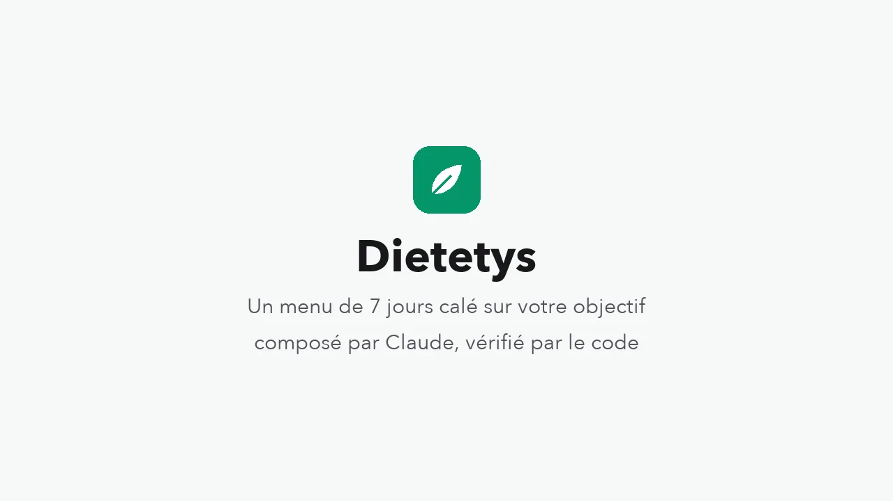
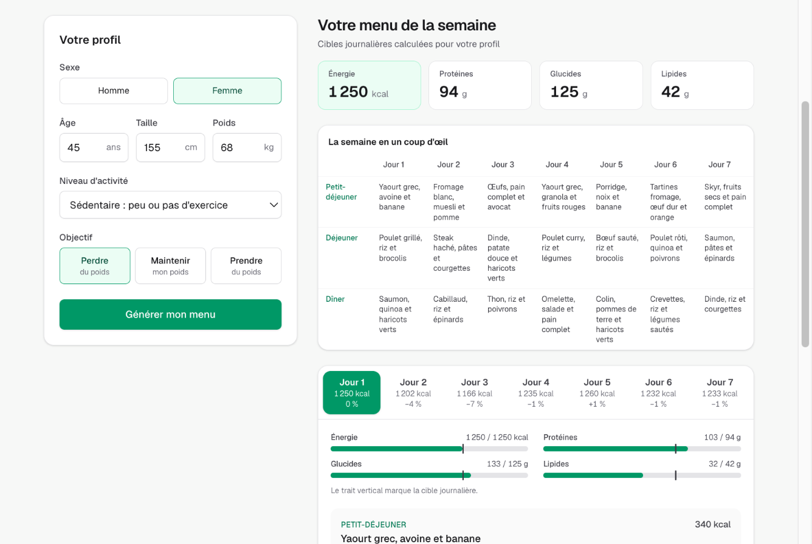
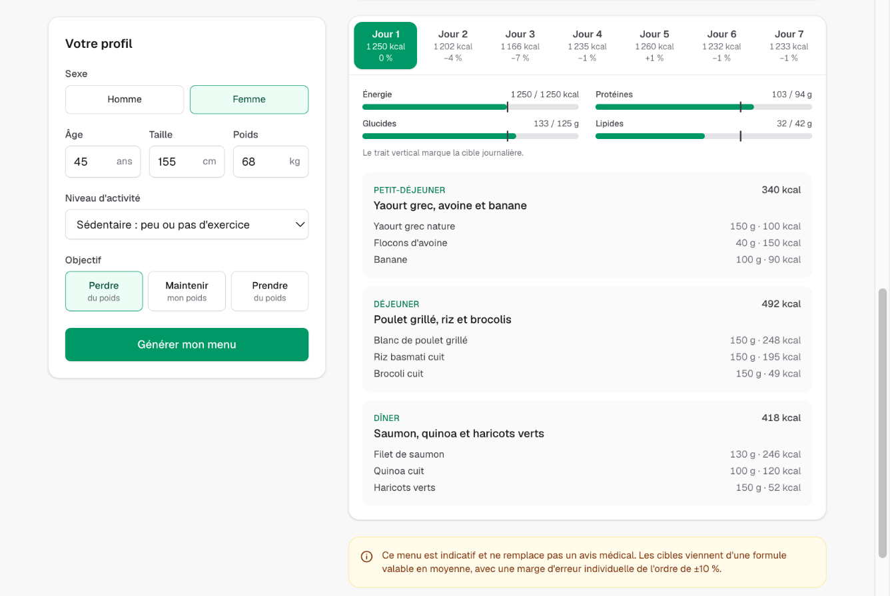
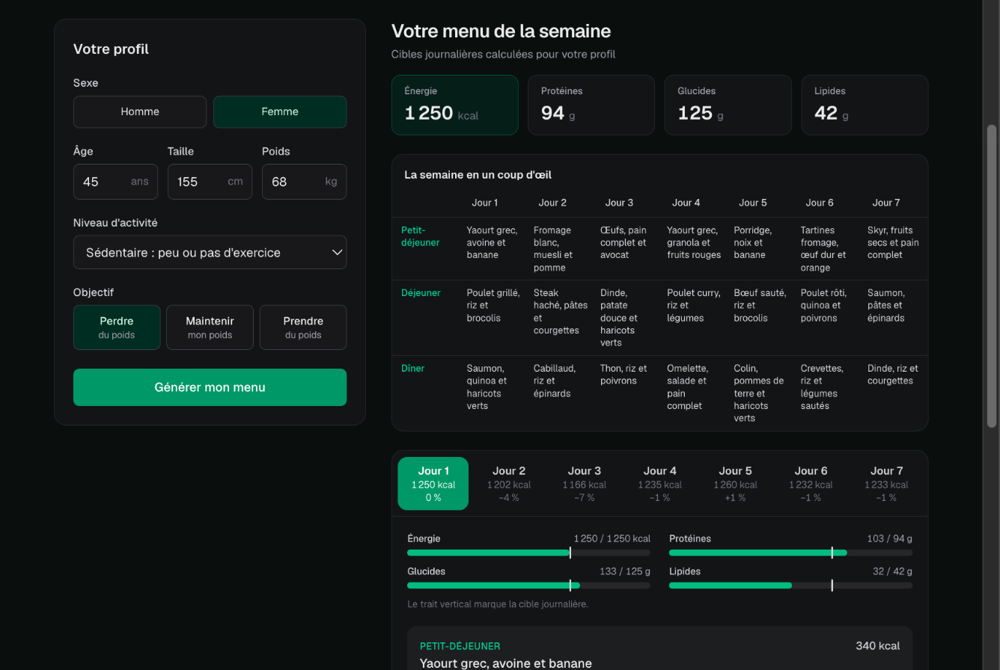
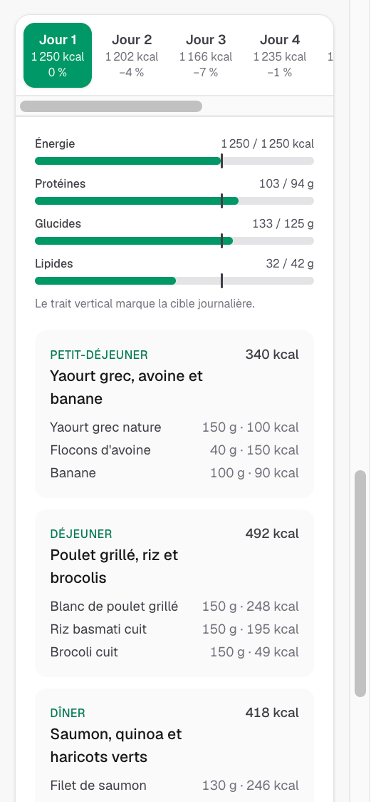

# Dietetys

Projet d'apprentissage : une application qui génère un menu de 7 jours à
partir du sexe, de l'âge, de la taille, du poids, du niveau d'activité et
d'un objectif (perdre, maintenir ou prendre du poids).

Le principe directeur : **tout calcul nutritionnel est fait en code, jamais
par le LLM.** Le code calcule les cibles journalières (kcal, protéines,
glucides, lipides) ; Claude compose des repas qui les respectent ; le code
vérifie le menu avant de l'afficher.

Spécification complète (architecture, contrats, validation, résultats des
évaluations, bilan) :
[Dietetys – Spécification MVP](https://claude.ai/code/artifact/cdbee86f-d3d5-4a03-bf42-98e39c0cbfb4).



*Démo de 35 secondes. Le menu affiché est un vrai menu produit par Claude
pendant les évaluations ; l'attente (1 à 6 minutes en réalité) a été
raccourcie.*



| Détail d'un jour | Mode sombre | Mobile |
| --- | --- | --- |
|  |  |  |

Les captures montrent un vrai menu produit par le modèle pendant les
évaluations (profil « Perte, petite cible »).

## Fonctionnement

1. **Formulaire** : la saisie est validée dans le navigateur avec le même
   schéma Zod que le serveur.
2. **`POST /api/menu`** : le serveur revalide l'entrée, refuse un objectif
   de perte de poids si l'IMC est inférieur à 18,5, applique une limitation
   de débit, puis calcule les cibles (Mifflin-St Jeor, multiplicateur
   d'activité, ajustement selon l'objectif, plancher de sécurité).
3. **Génération** : Claude (Sonnet 5, sortie structurée) compose le menu à
   partir des seules cibles chiffrées.
4. **Validation** : quatre contrôles (schéma, cohérence d'Atwater de chaque
   aliment, respect des cibles, diversité). En cas d'échec, une seule
   relance avec la liste des erreurs, sinon une erreur 502.
5. **Affichage** : cibles, semaine en un coup d'œil, puis un onglet par jour
   avec ses totaux comparés aux cibles.

Une génération prend de 1 à 6 minutes et coûte environ 0,25 $. Elle est
bornée à 10 minutes et s'arrête si l'utilisateur annule ou quitte la page.

## Installation

Prérequis : Node.js 24 et une clé API Anthropic.

```bash
npm install
cp .env.example .env.local
# Puis renseigner ANTHROPIC_API_KEY dans .env.local
npm run dev
```

L'application est alors sur http://localhost:3000. Par défaut, `next dev`
écoute sur toutes les interfaces réseau : pour la réserver à votre machine,
utilisez `npm run dev -- -H 127.0.0.1`.

## Commandes

| Commande | Effet |
| --- | --- |
| `npm run dev` | Serveur de développement (http://localhost:3000) |
| `npm run build` | Build de production |
| `npm test` | Tests (Vitest), sans appel au LLM |
| `npm run lint` | ESLint |
| `npx tsc --noEmit` | Vérification des types |
| `npm run check:api` | Vérifie que la clé API Anthropic fonctionne |
| `npm run menu -- femme 30 165 60 modere perte` | Génère et affiche un menu en ligne de commande (appel facturé) |
| `npm run evaluer -- <nom-campagne>` | Campagne d'évaluation sur 6 profils (environ 2 $ et 20 minutes) |

## Structure

```
src/app/              Page, composants React et route POST /api/menu
src/lib/contracts/    Schémas Zod et types partagés (entrée, menu, réponse)
src/lib/domain/       Calculs nutritionnels : fonctions pures, testées
src/lib/validation/   Les quatre contrôles du menu et leurs seuils
src/lib/llm/          Prompt, orchestrateur (appel, relance, logs), coût
src/lib/api/          Limitation de débit
scripts/evaluation/   Profils, mesures, campagnes et sorties réelles du modèle
docs/captures/        Captures d'écran
```

## Qualité

- **146 tests** : domaine, validation, orchestrateur (modèle simulé), route
  (orchestrateur simulé), appel client, rendu des composants, et rejeu de la
  validation sur de vraies sorties du modèle.
- **Intégration continue** (GitHub Actions) : types, lint et tests à chaque
  push.
- **Évaluations** : trois campagnes sur 6 profils, de 1 250 à 3 950 kcal.
  Validité finale de 100 %, de 50 à 83 % au premier essai, menus en moyenne
  environ 5 % sous la cible calorique.
- **Logs JSON** : une ligne par appel au modèle (tokens, coût, latence,
  contrôles échoués, version du prompt) et par requête, reliées par un
  identifiant, sans données personnelles.

## Limites connues

- Les valeurs nutritionnelles des aliments sont estimées par le LLM : le
  contrôle d'Atwater détecte les incohérences, pas les approximations.
- Les menus restent en moyenne environ 5 % sous la cible calorique.
- Aucune persistance : le menu est perdu au rechargement de la page.
- Limitation de débit en mémoire, pensée pour un seul utilisateur en local.
- Les formules nutritionnelles sont des moyennes de population (marge
  individuelle de l'ordre de ±10 %) : les menus sont indicatifs et ne
  remplacent pas un avis médical.
